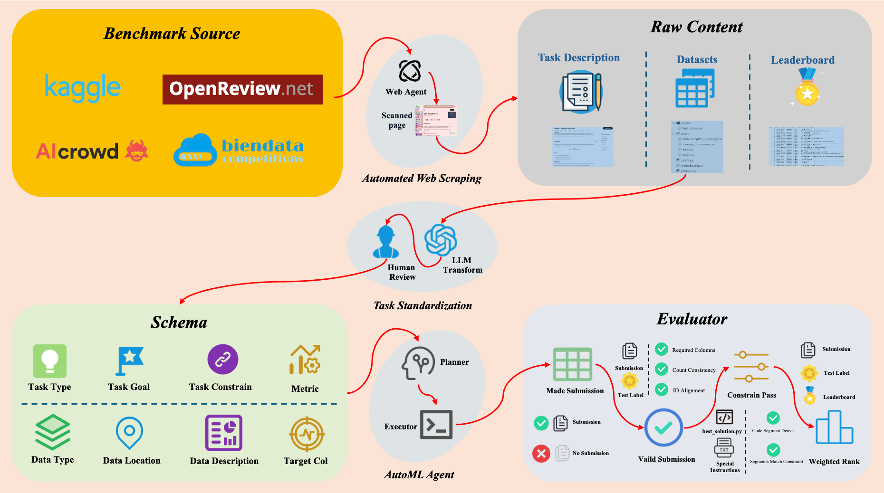

# TAM-Bench: Towards Adaptive ML Benchmarks

**TAM-Bench** is a benchmark for evaluating **LLM-driven AutoML Agents** on end-to-end machine learning tasks. It covers the full ML workflow, including **data analysis, feature engineering, model training, and competition problem solving**.

This project is based on the paper:

> *Towards Adaptive ML Benchmarks: Web-Agent-Driven Construction, Domain Expansion, and Metric Optimization*

---

## ✨ Key Features



* **Automated Task Collection**
  Tasks are automatically collected from Kaggle, AIcrowd, Biendata via Web-Agents and standardized into a unified schema across multiple data modalities (Tabular, Text, Image, Audio, Graph, Multimodal).

* **Multi-Dimensional Evaluation**
  Beyond raw performance, TAM-Bench evaluates **format compliance, constraint adherence, and task generalization**, preventing “high score but unusable” solutions.

* **Leaderboard-Based Difficulty Modeling**
  Task difficulty is inferred from leaderboard statistics (participant counts, score distributions), categorized into **Easy / Medium / Hard**.

* **Three Benchmark Scales**

  * **Lite (released)**: 18 tasks across 6 modalities × 3 difficulty levels.
  * **Medium (coming soon)**: 54 tasks.
  * **Full (coming soon)**: 150 tasks.

---

## 📂 Dataset

Due to dataset size, only evaluation scripts are included in this repo. Datasets can be downloaded from external storage.

* **Download datasets**:
    * 链接: https://pan.baidu.com/s/1MrwJLhbOsZ6LMZStF6VBRQ?pwd=1crw 提取码: 1crw
* **Preprocess with**:

  * `DataProcess.py`: moves and organizes downloaded files into the correct folder structure.

Each task directory follows this structure:

```
Modality/Difficulty/
    ├── data/
    │   ├── public/           # training & validation data
    │   └── private/          # hidden test labels
    ├── input/
    │   └── input.json        # task description and constraints
    └── evaluation/
        ├── grade.py          # compute metric score from submission.csv
        ├── ScoreRank.py      # map metric score to leaderboard percentile
        ├── eval_constraint.py# check constraint compliance
        └── leaderboard.csv   # official leaderboard for percentile ranking
```

---

## 🚀 Evaluation Pipeline

The evaluation consists of **two steps**:

### 1. Agent Execution

* **Input**: `input/input.json`
* **Dataset**: `data/public/`
* **Expected Output** (in `workplace/`):

  * `submission.csv` (predictions)
  * final solution code (e.g., `solution.py`)
  * optional logs

*(This step depends on your own Agent implementation.)*

### 2. Evaluation

All scripts are located inside the task’s `evaluation/` folder:

* **`grade.py`**

  * Input: `submission.csv` (from workplace) + ground-truth in `data/private/`
  * Output: metric score
  * Prints error if `submission.csv` is missing, misformatted, or invalid.

* **`ScoreRank.py`**

  * Input: metric score (from `grade.py`) + `leaderboard.csv`
  * Output: percentile rank of the submission on the leaderboard.

* **`eval_constraint.py`**

  * Input: `input.json` + final solution code (from workplace)
  * Output: constraint pass rate (Yes/No for each constraint).

---

## 🛠️ Example Usage

A typical workflow for running evaluation on a single task:

```bash
# Step 1: Run your Agent (custom implementation)
# Expected outputs go to workplace/: submission.csv, solution.py, logs...

# Step 2: Evaluate predictions
cd Modality/Difficulty/evaluation
python grade.py --submission ../../workplace/submission.csv --private ../../data/private/

# Step 3: Rank on leaderboard
python ScoreRank.py --score result.json --leaderboard leaderboard.csv

# Step 4: Check constraint compliance
python eval_constraint.py --input ../../input/input.json --solution ../../workplace/solution.py
```

Final evaluation consists of:

* **Metric score** (from `grade.py`)
* **Leaderboard percentile rank** (from `ScoreRank.py`)
* **Constraint pass rate** (from `eval_constraint.py`)

---

## 📊 Example Results


More results are reported in the paper.

---

## 📌 Roadmap

* [x] Release Lite version (18 tasks)
* [ ] Release Medium version (54 tasks)
* [ ] Release Full version (150 tasks)
* [ ] Add benchmark results for more AutoML agents

---

## 🔗 Citation

If you use TAM-Bench in your research, please cite:

```
@article{tam-bench-2025,
  title={Towards Adaptive ML Benchmarks: Web-Agent-Driven Construction, Domain Expansion, and Metric Optimization},
  author={Anonymous},
  year={2025}
}
```

---

## 🤝 Contributing

We welcome contributions! You can help by:

* Adding new benchmark tasks
* Proposing additional evaluation metrics
* Submitting benchmark results for new models/agents
